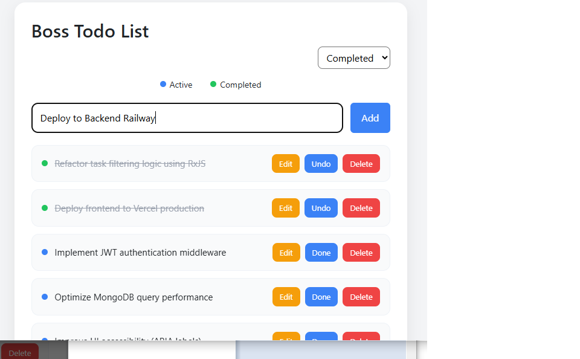
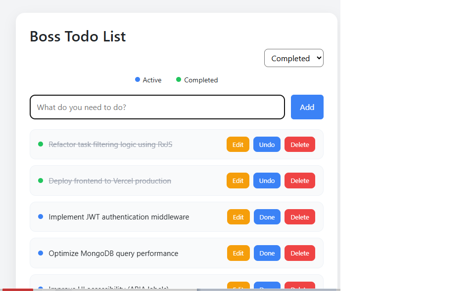
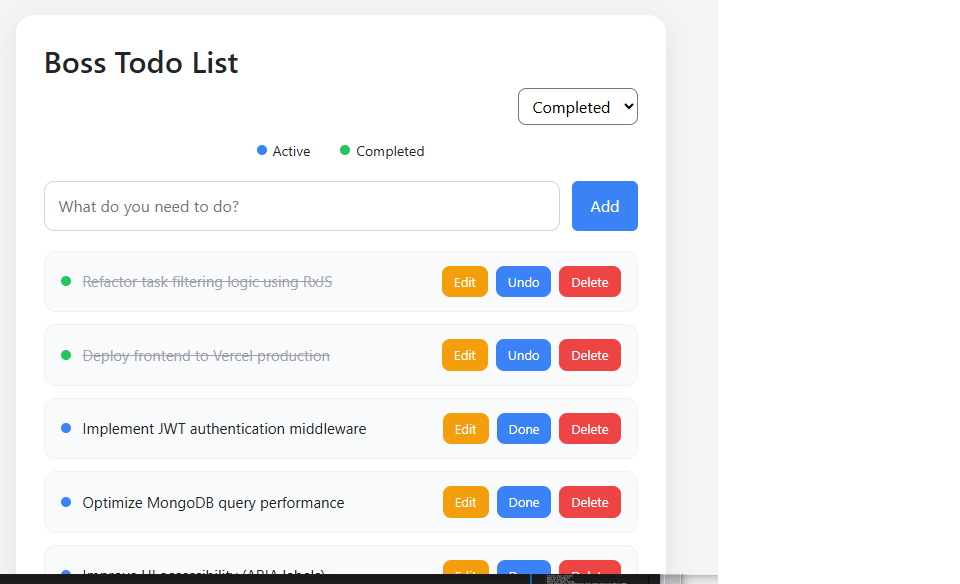
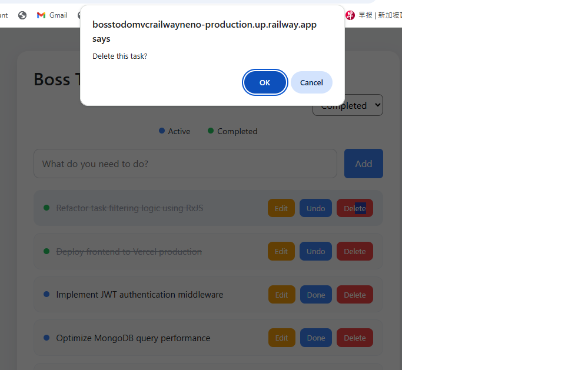
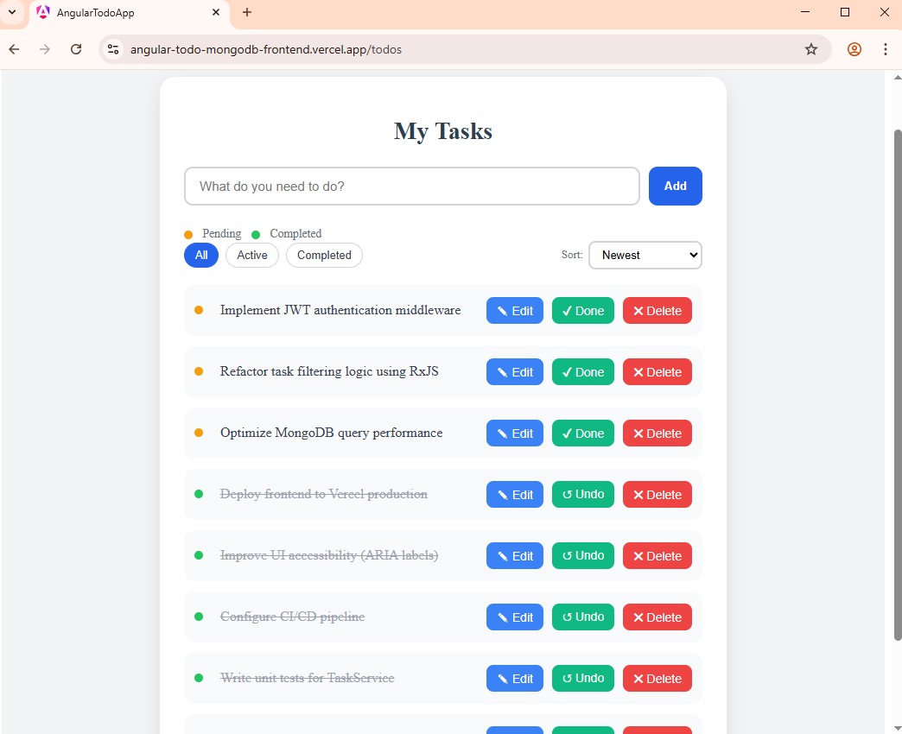

## 🟦 BossTodoMvc — Clean Architecture ASP.NET Core 8 Showcase

### Project Overview

BossTodoMvc is a production-ready ASP.NET Core 8 MVC application designed to demonstrate clean architecture principles, layered separation of concerns, and server-side business logic orchestration, domain-driven design principles, and cloud-ready deployment practices

The application supports task management with responsive UI design
and has been validated across multiple browsers.

The project showcases enterprise-ready patterns including:

* Service Layer abstraction
* Repository pattern
* Domain-driven entity encapsulation
* Cookie-based authentication
* Cloud deployment (Railway + Neon PostgreSQL)
* Server-side filtering and sorting logic
* Responsive UI design

This project is intentionally structured to reflect real-world enterprise web application architecture.

---
## 📎 Live Demo

Production Deployment:
👉 [https://bosstodomvcrailwayneno-production.up.railway.app] URL : https://bosstodomvcrailwayneno-production.up.railway.app

## 📂 Repository
* 🔗 **GitHub Repository :** https://github.com/Heng03a/BossTodoMvc_Railway_Neno/#-bosstodomvc--clean-architecture-aspnet-core-8-showcase

## 🛠 Tech Stack

### Frontend

* .NET Core 8.0 MVC Controllers
* Razor Views
* Responsive CSS (Flexbox)
* Boss please Elevate

### Backend

* EF Entity
* EF Core Repository + Service pattern
* Boss please Elevate

### Database

* PostgreSQLDB (Cloud-hosted Neon)

### Authentication
* Cookie Authentication
* Boss please Elevate

### Deployment

* Railway (Frontend)
* Neon PostgreSQLDB (Backend Database)
* Boss please Elevate

## ✨ Core/Key Features

* Secure user authentication (Boss please Elevate - login/register)
* Full CRUD task management
* Real-time UI updates
* Task filtering & sorting logic
* Responsive mobile-first layout
* Cross-origin secured communication
* Modular and clean project folder structure for maintainability
* Boss please Elevate


## 📸 Screenshots - ✨ Key Functional Features

**Add Task**  


**Task Completed**  



**Sort Completed Task First**  


**Delete task**  


---


## 🧠 Architecture / Logic Design
- Authentication: Boss Please Elevate
- Deployment: Railway (Frontend), Neon (Backend)
- Architecture Pattern: Layered Architecture

## 🏗 Architecture Overview
Architecture Overview
-<p> User Browser</p>
-<p>  │           </p>
-<p>  ▼           </p>
- <p>ASP.NET Core MVC Web Application</p>
-<p>     │
-     │ Application Services
-     ▼
- Domain  
- Business Rules
-     │
-     ▼
- Infrastructure Layer
- Repository Pattern
-     │
-     ▼
- PostgreSQL Database (Neon)

- Architecture Layered design:

* Domain Layer
  - Encapsulated entities with behavior methods (ToggleComplete, UpdateTitle).
  - Read-only properties
  - State transitions via domain methods:

  * `ToggleComplete()`
  * `UpdateTitle()`
  * Prevents direct state mutation (DDD principle)

* Application Layer
- Service layer implementing business rules (sorting, filtering, orchestration).
- Business logic orchestration:
  * Filtering
  * Sorting
  * Task creation
  * State changes
* No data access logic inside services

* Infrastructure Layer
* EF Core repository implementation with PostgreSQL (Neon cloud).
* Repository pattern (`ITodoRepository`)
* No business logic leakage

* Web Layer
* MVC Controllers, Razor Views, Cookie Authentication.
* Model validation & user feedback
* Query-string driven sorting (`?sort=completed`, etc.)

No business logic leaks into repository.

The project intentionally separates concerns across Domain, Application, Infrastructure, and Web layers to reflect real-world enterprise web application architecture. 
This architecture demonstrates clean layering and separation of responsibilities.

This showcase highlights:

* Clean Architecture implementation
* Repository + Service pattern
* Domain-encapsulated entities
* Server-side filtering & sorting logic
* Cookie-based authentication
* PostgreSQL cloud integration (Neon)
* CI/CD deployment via Railway
* Responsive UI design

## ## Architectural - Engineering Principles Applied - Key Engineering Decisions

* Sorting logic controlled at service layer (not repository).
* Repository returns raw dataset (no enforced ordering).
* Domain entity properties are read-only — state changes via domain methods.
* Clean separation between authentication and business logic.

  Explicit Query-Driven Behavior

  Sorting is controlled via URL parameters:

  ```
  /Todos?sort=completed
  /Todos?sort=active
  /Todos?sort=oldest
  /Todos?sort=newest
  ```
  
  This demonstrates server-side orchestration and predictable routing behavior.


### Authentication & Security

* Cookie-based authentication
* Claims identity
* Model validation with user feedback
* Server-side validation for task operations
* Authorization attribute on controller
---

## Reusable Application Template Architecture
### Reusable Prototype-Oriented Architecture
- The projects in this portfolio were intentionally structured to serve not only as standalone applications
- but also as reusable templates for rapid application development.

- By designing the applications with modular architecture and clear separation of concerns,
- the codebase can be reused as a foundation for building new systems quickly while
- maintaining architectural consistency.

- This approach is commonly used in enterprise environments to accelerate the
- development of new products and prototypes.

### Why Reusable Templates Matter
    - In real-world software development, new projects often require similar foundational components such as:
      • Authentication mechanisms
      • Database access layers
      • API service structures
      • UI layout frameworks
      • Deployment configurations
           
      - Instead of rebuilding these components repeatedly, reusable templates enable developers
      - to <b>bootstrap new applications rapidly while preserving engineering best practices.
      - Benefits include:
      -
        • Faster prototype development</br>
        • Consistent architectural standards</br>
        • Reduced technical debt</br>
        • Easier onboarding of development teams</br>
      </p>

## Engineering Challenges & Solutions
   - Engineering Challenges & Solutions
   - During development and deployment of the applications, 
   - several real-world engineering challenges were encountered and resolved. 
   - These challenges reflect common issues faced when building modern distributed web systems.

   ### Challenge 1 — Cross-Origin Resource Sharing (CORS)
     - Problem

     - The Angular frontend and Node.js backend were deployed on separate cloud platforms. Because the services were hosted on different domains, browser security policies blocked API requests due to cross-origin restrictions.

       - Example Deployment Architecture

         - Frontend: Vercel
         - Backend: Railway
         - Without proper configuration, browser requests from the frontend application could not reach the backend API.

    - Solution

      - Explicit CORS configuration was implemented on the backend server to allow trusted origins while preserving browser security enforcement.

      - app.use(cors({
      - origin: [
      - "https://your-vercel-app.vercel.app"
      - ],
      - credentials: true
      - }));

      - Engineering Outcome

      - Secure communication between distributed frontend and backend services 
      - was successfully established while maintaining strict browser security controls.

   ### Challenge 2 — Cross-Browser Rendering Consistency
       - Problem

       - Different browsers implement layout engines differently, which can lead to subtle inconsistencies in CSS rendering and UI behaviour.

       - Solution

         - The applications were tested across multiple browser engines to verify layout consistency and interaction reliability.

           - Google Chrome (Blink)
           - Microsoft Edge (Blink)
           - Mozilla Firefox (Gecko)
           - Validation included:

             - Authentication flows
             - Task management UI
             - Sorting and filtering behaviour
             - Responsive layout scaling

        - Engineering Outcome

        - The application UI renders consistently across major browser engines, ensuring a stable user experience across platforms.

   ### Challenge 3 — Responsive Layout Stability
       - Problem
  
       - Modern web applications must remain usable across a wide range of device screen sizes. Without responsive design strategies, layouts can break on smaller devices.

       - Solution

         - Responsive design techniques were applied to ensure adaptive layouts across desktop, tablet, and mobile devices.

         - Flexible layout containers
         - Media query breakpoints
         - Relative sizing units
         - Mobile-first layout testing
         - Layout behaviour was validated across screen widths ranging from 320px to 1440px 
         - using browser developer tools and responsive testing.

      - Engineering Outcome

      - The interface remains fully functional and visually consistent across multiple device 
      - categories and screen resolutions


## 🎨 UI & UX

* Responsive card-based layout
* Clear task state indicators
* Visual grouping via status dot
* Consistent button styling
* Server-driven state refresh (no JS framework dependency)

### What this Project demonstrates

This project demonstrates:

* Production-oriented ASP.NET Core MVC design
* Cloud-hosted database integration
* DevOps awareness
* Clean layered architecture
* EF Core with PostgreSQL
* Cloud database integration
* CI/CD deployment pipelines
* Production debugging (Release-mode validation)
* Separation of business logic and persistence

* Clean separation of concerns

## Responsive Design Strategy

- This application uses a **mobile-first responsive CSS architecture**.

* Base styles are designed for small screens without relying on media queries.
* Layouts use flexible units (`rem`, `%`) and modern layout systems (`flexbox`) to adapt naturally across screen sizes.
* Media queries are applied using `min-width` breakpoints to progressively enhance the interface for larger viewports.

### Key design decisions include:

* A global reset using `box-sizing: border-box` to ensure consistent layout calculations.
* A responsive page wrapper with fluid width and controlled maximum width for desktop readability.
* Vertical stacking for form controls on mobile, enhanced to horizontal layouts on larger screens.
* Touch-friendly spacing and scalable typography to support usability on all devices.

- This approach ensures the application works **anytime, anywhere, on any device**, - without duplicating layout logic or relying on device-specific assumptions.

## 📱 Responsive & Cross-Browser Validation
* Mobile-first  UI design layout

## 📱 Responsive Design Strategy and Implementation
- This application was built using a mobile-first design philosophy.
- Core Responsive Characteristics
* Flexible layout containers
* Centered content wrapper
* Adaptive button stacking on smaller screens
* Touch-friendly controls
* Consistent spacing & alignment
* No layout shift across breakpoints

## Breakpoint Strategy
* Mobile: 360px+
* Tablet: 768px+
* Desktop: 1024px+
The layout maintains structural integrity across device sizes.

## 🎯 Feature Set
### Functional Features
* Add new tasks
* Edit existing tasks
* Delete tasks
* Mark complete / undo
* Sort by: 
* Newest
* Oldest
* Completed First
* Active First

### UX Enhancements
* Status indicator legend
* Stable button alignment
* Clear visual hierarchy
* Clean typography and spacing


## 📱 Responsive Design Validation - Proof
- Tested on Chrome, Edge, Firefox
- Flexbox-based layout
- Overcome Responsive container constraints

### Desktop View


### Tablet View


### Mobile View


## 🌐 Cross-Browser Compatibility

Tested on:

- Google Chrome (latest)
- Microsoft Edge (latest)
- Firefox (latest)

All layout and interactive functionality are working consistently across modern browsers.

## 📱 Cross-browser Reliability Proof

| Google Chrome | Microsoft Edge | Firefox |
|---------------|----------------|---------|
|  |  |  |


## ☁ Deployment Architecture

* Hosted on Railway
* PostgreSQL on Neon
* GitHub → CI/CD auto-deploy
* Release-mode publish verified before deployment
## Deployment Details - ☁️ Cloud Deployment & CI/CD
Deployment Details
* Local development
* git add, git commit, git push
* Railway auto-build triggered
* Backend auto-deployed - Neon
* Production URL updated
- No manual server management required.
* Production Characteristics
* Always available (24/7)
* Serverless frontend hosting
* Managed backend runtime -‭ Neon
* Managed database - Neon
* Automatic build pipeline

* Deployment Flow:
  ```
  Git Push → Railway Auto Build → Docker Publish (Release Mode) → Live Deployment
  ```
All deployments validated using:
```
  dotnet publish -c Release
```

### ▶️ Run Locally
* Frontend
* dotnet run --project src/BossTodoMvc.Web
* npm install 
* Access:
* http://localhost:5288/Auth/Login
	Access :-
	http://localhost:5288
	* Redirect to `/Auth/Login`
	* After login → `/Todos/Index`http://localhost:5288

### 📎 Run Live
	Production Deployment:
	👉 [https://bosstodomvcrailwayneno-production.up.railway.app] URL : https://bosstodomvcrailwayneno-production.up.railway.app


## 🚀 Future Enhancements (Planned)

* Containerization via Docker
* Structured logging (Serilog)
* Unit testing of Service layer
* Role-based authorization
* API version (REST endpoint exposure)
* Azure or Render deployment comparison

---

# 🔷 Why This Project Matters

BossTodoMvc is not a tutorial CRUD application.

It is intentionally designed to reflect:

* Enterprise layering discipline
* Service-oriented business logic
* Cloud-hosted database architecture
* Deployment validation practices

It represents real-world backend engineering structure.

## Application Built and maintained by :-

Jialumen (Phua Kia Heng)

Full Stack Web Developer
Singapore

GitHub: https://github.com/Heng03a
