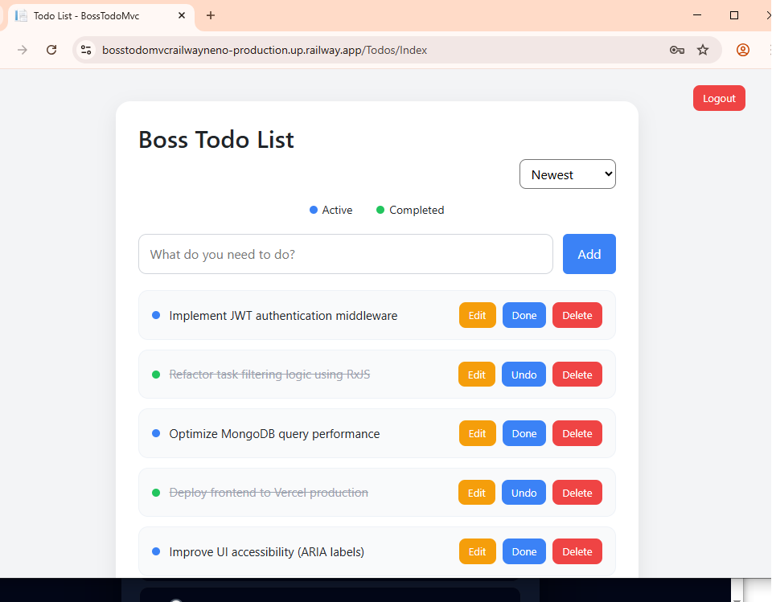
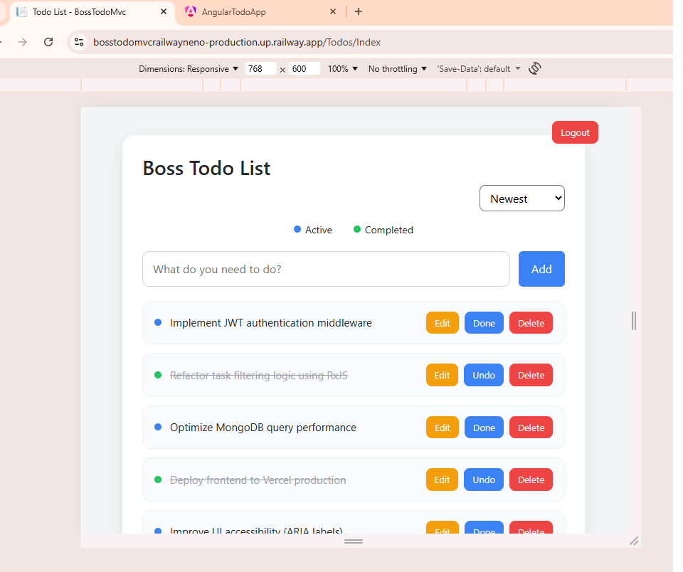
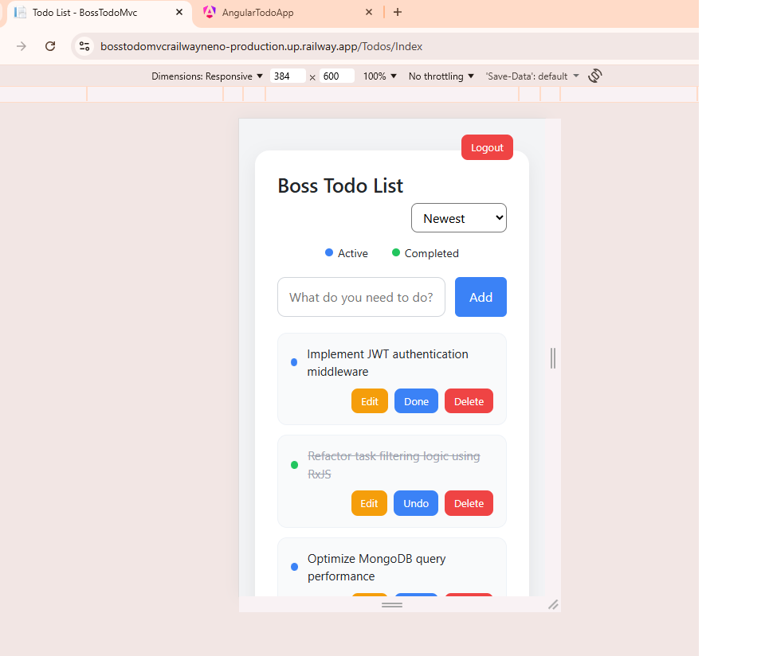
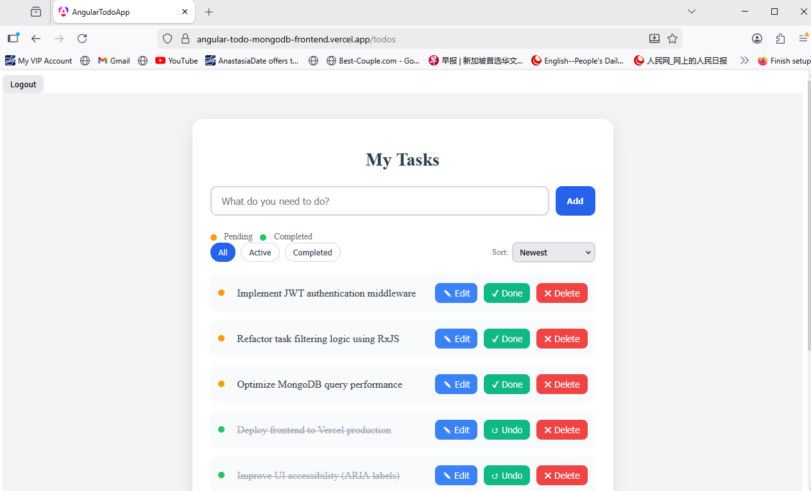
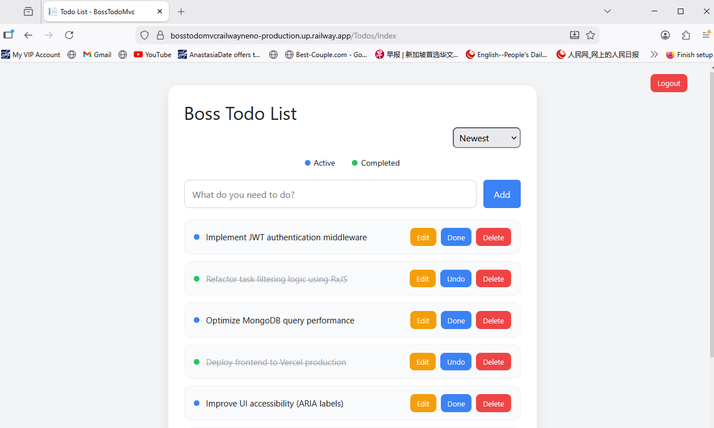

## 🟦 BossTodoMvc — Clean Architecture ASP.NET Core 8 Showcase

### Project Overview

BossTodoMvc is a production-ready ASP.NET Core 8 MVC application designed to demonstrate clean architecture principles, layered separation of concerns, and server-side business logic orchestration, domain-driven design principles, and cloud-ready deployment practices

The application supports task management with responsive UI design
and has been validated across multiple browsers.

The project showcases enterprise-ready patterns including:

* Service Layer abstraction
* Repository pattern
* Domain-driven entity encapsulation
* Cookie-based authentication
* Cloud deployment (Railway + Neon PostgreSQL)
* Server-side filtering and sorting logic
* Responsive UI design

This project is intentionally structured to reflect real-world enterprise web application architecture.

---
## 📎 Live Demo

Production Deployment:
👉 [https://bosstodomvcrailwayneno-production.up.railway.app] URL : https://bosstodomvcrailwayneno-production.up.railway.app

## 📂 Repository
* 🔗 **GitHub Repository :** https://github.com/Heng03a/BossTodoMvc_Railway_Neno/#-bosstodomvc--clean-architecture-aspnet-core-8-showcase

## 🛠 Tech Stack

### Frontend

* Angular
* TypeScript
* RxJS
* Responsive CSS (Flexbox)

### Backend

* Node.js
* Express.js
* RESTful API design

### Database

* MongoDB Atlas (Cloud-hosted NoSQL database)

### Authentication

* JWT (JSON Web Token)
* Stateless session management

### Deployment

* Vercel (Frontend)
* Railway (Backend)
* Distributed cloud architecture

## ✨ Core/Key Features

* Secure user authentication (JWT-based login/register)
* JWT-based authorization via HTTP headers
* RESTful API with structured routing
* Full CRUD task management
* Real-time UI updates
* Task filtering & sorting logic
* Responsive mobile-first layout
* Cross-origin secured communication
* Modular and clean project folder structure for maintainability

## 🧠 Architecture / Logic Design
- Authentication: JWT (JSON Web Token)
- Deployment: Vercel (Frontend), Railway (Backend)
- Architecture Pattern: Distributed Client-Server Architecture

## 🏗 Architecture Overview
Architecture Overview
User Browser
      │
      ▼
ASP.NET Core MVC Web Application
      │
      │ Application Services
      ▼
Domain Layer
Business Rules
      │
      ▼
Infrastructure Layer
Repository Pattern
      │
      ▼
PostgreSQL Database

Architecture Layered design:

* Domain Layer
  Encapsulated entities with behavior methods (ToggleComplete, UpdateTitle).
  Read-only properties
  State transitions via domain methods:

  * `ToggleComplete()`
  * `UpdateTitle()`
  * Prevents direct state mutation (DDD principle)

* Application Layer
  Service layer implementing business rules (sorting, filtering, orchestration).
  Business logic orchestration:
  * Filtering
  * Sorting
  * Task creation
  * State changes
* No data access logic inside services

* Infrastructure Layer
  EF Core repository implementation with PostgreSQL (Neon cloud).
  Repository pattern (`ITodoRepository`)
  No business logic leakage

* Web Layer
  MVC Controllers, Razor Views, Cookie Authentication.
  Model validation & user feedback
  Query-string driven sorting (`?sort=completed`, etc.)

No business logic leaks into repository.

The project intentionally separates concerns across Domain, Application, Infrastructure, and Web layers to reflect real-world enterprise web application architecture. 
This architecture demonstrates clean layering and separation of responsibilities.

This showcase highlights:

* Clean Architecture implementation
* Repository + Service pattern
* Domain-encapsulated entities
* Server-side filtering & sorting logic
* Cookie-based authentication
* PostgreSQL cloud integration (Neon)
* CI/CD deployment via Railway
* Responsive UI design

### Key Engineering Decisions

* Sorting logic controlled at service layer (not repository).
* Repository returns raw dataset (no enforced ordering).
* Domain entity properties are read-only — state changes via domain methods.
* Clean separation between authentication and business logic.

  Explicit Query-Driven Behavior

  Sorting is controlled via URL parameters:

  ```
  /Todos?sort=completed
  /Todos?sort=active
  /Todos?sort=oldest
  /Todos?sort=newest
  ```
  
  This demonstrates server-side orchestration and predictable routing behavior.


### Authentication & Security

* Cookie-based authentication
* Claims identity
* Model validation with user feedback
* Server-side validation for task operations
* Authorization attribute on controller
---

### ☁ Deployment Architecture

* Hosted on Railway
* PostgreSQL on Neon
* GitHub → CI/CD auto-deploy
* Release-mode publish verified before deployment
* Deployment Flow:
  ```
  Git Push → Railway Auto Build → Docker Publish (Release Mode) → Live Deployment
  ```
All deployments validated using:
```
  dotnet publish -c Release
```
## 🎨 UI & UX

* Responsive card-based layout
* Clear task state indicators
* Visual grouping via status dot
* Consistent button styling
* Server-driven state refresh (no JS framework dependency)

### What Project demonstrates

This project demonstrates:

* Production-oriented ASP.NET Core MVC design
* Cloud-hosted database integration
* DevOps awareness
* Clean layered architecture
* EF Core with PostgreSQL
* Cloud database integration
* CI/CD deployment pipelines
* Production debugging (Release-mode validation)
* Separation of business logic and persistence

* Clean separation of concerns

## 📱 Responsive & Cross-Browser Validation
* Mobile-first  UI design layout

## 📱 Responsive Design Proof
- Tested on Chrome, Edge, Firefox
- Flexbox-based layout
- Overcome Responsive container constraints

### Desktop View


### Tablet View


### Mobile View



## 📱 Responsive Design Implementation
- This application was built using a mobile-first design philosophy.
- Core Responsive Characteristics
* Flexible layout containers
* Centered content wrapper
* Adaptive button stacking on smaller screens
* Touch-friendly controls
* Consistent spacing & alignment
* No layout shift across breakpoints

## Breakpoint Strategy
* Mobile: 360px+
* Tablet: 768px+
* Desktop: 1024px+
The layout maintains structural integrity across device sizes.

## 🎯 Feature Set
### Functional Features
* Add new tasks
* Edit existing tasks
* Delete tasks
* Mark complete / undo
* Sort by: 
* Newest
* Oldest
* Completed First
* Active First

### UX Enhancements
* Status indicator legend
* Stable button alignment
* Clear visual hierarchy
* Clean typography and spacing

## 🌐 Cross-Browser Compatibility

-Tested on:

- Google Chrome (latest)
- Microsoft Edge (latest)
- Firefox (latest)

-All layout and interactive functionality are working consistently across modern browsers.

## 📱 Cross-browser Reliability Proof
### Google Chrome


### Microsoft Edge


### Firefox


    
## 🚀 Future Enhancements (Planned)

* Containerization via Docker
* Structured logging (Serilog)
* Unit testing of Service layer
* Role-based authorization
* API version (REST endpoint exposure)
* Azure or Render deployment comparison

---

# 🔷 Why This Project Matters

BossTodoMvc is not a tutorial CRUD application.

It is intentionally designed to reflect:

* Enterprise layering discipline
* Service-oriented business logic
* Cloud-hosted database architecture
* Deployment validation practices

It represents real-world backend engineering structure.

## Application Built and maintained by :-

Jialumen (Phua Kia Heng)

Full Stack Web Developer
Singapore

GitHub: https://github.com/Heng03a
